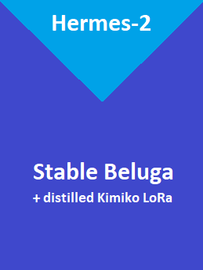

## BlockMerge Gradient (Tensors Edition)

[Credit to TekVenom for the original concept!](https://github.com/TehVenomm/LM_Transformers_BlockMerge)

This script allows you to merge two finetuned Llama 1/2 language models by blending their layers. This can be useful for creating ensembles of models or combining the strengths of two different models into a singular model. The merger is done based on a specified gradient between the two models.

**Word of warning:** Do not attempt to merge Llama 1 with Llama 2 models. It will work, but it'll result in a garbled mess.

Unless you have 128 GB RAM, this process will take up a lot of virtual memory. Spread your swapfile over multiple drives for optimal performance.

### Usage

You can run the script using the command:

```bash
python BlockMerge_Gradient_Tensors.py --model_path1 /path/to/model1 --model_path2 /path/to/model2 --output_model_path /path/to/output --gradient_values '[1.0, 0.5, 0.0]' --max_shard_size '2000MiB' [--layer_only] [--no_layers]
```

### Parameters:

#### Required:

- `--model_path1`:  
    - Description: Path to the directory containing the first model.
    - Type: String

- `--model_path2`:  
    - Description: Path to the directory containing the second model.
    - Type: String

- `--output_model_path`:  
    - Description: Path where the merged model will be saved.
    - Type: String

- `--gradient_values`:  
    - Description: List of gradient values. Represents how the tensors of the two models should be merged.
    - Example: [1.0, 0.5, 0.0]
    - Type: List of floats

#### Optional:

- `--max_shard_size`:  
    - Description: Specify the maximum shard size when saving the model.
    - Default: "2000MiB"
    - Type: String

- `--layer_only`:  
    - Description: If set, only process tensors with keys containing "layer". This option and `--no_layers` are mutually exclusive.
    - Type: Flag

- `--no_layers`:  
    - Description: If set, only process tensors with keys NOT containing "layer". This option and `--layer_only` are mutually exclusive.
    - Type: Flag

---

### Gradient Values (`gradient_values`)

**Definition:**  
The `gradient_values` parameter is a list of floats representing the blend ratio of how the tensors of the two models should be merged. The values typically range between 0.0 and 1.0, where:

- `1.0` means 100% of the tensor values come from `model2`.
- `0.0` means 100% of the tensor values come from `model1`.

Any value in between (e.g., `0.5`) means a blend of both `model1` and `model2` for that particular tensor.

**How It Works:**  
The list acts as a guide for how the blend ratio changes across the model's tensors. The script uses linear interpolation between the provided gradient values to generate a smooth gradient of blend ratios for all tensors in the model. 

**Example:**  
Suppose you provide the gradient values as `[1.0, 0.5, 0.0]`. This tells the script to start by blending tensors with 100% of `model2`'s values, gradually transition to a 50-50 blend between the two models, and finally to use only `model1`'s values.

Given this list, the script calculates the sections of tensors based on the gradient values. In this case, there are `3-1 = 2` sections. If there are, say, 24 tensors in the model:

- The first 12 tensors transition from 100% of `model2`'s values to a 50-50 blend.
- The next 12 tensors transition from a 50-50 blend to 100% of `model1`'s values.

So, the first tensor might be blended with 100% of `model2`'s value, the sixth tensor might be blended with around 75% of `model2`'s value (and 25% of `model1`), the twelfth tensor might be blended with 50% of each model, and so on.

**Important Note:**  
The script assumes that the list's length is one less than the total number of tensors divided by the sections. Any remainder is adjusted by using the last gradient value.

---

### Notes:

- The script assumes that the two models have similar architectures but can have different vocabulary sizes. In case of different vocabulary sizes, the script handles the differences for specific tensors ("lm_head.weight" and "model.embed_tokens.weight") by truncating model 2's vocab to match that the size of model 1.

- Relevant tokenizer files from the directory of `--model_path1` are also copied to the `--output_model_path` directory.

--- 

### Example



```bash
python BlockMerge_Gradient.py --model_path1 "stabilityai/StableBeluga-7B" --model_path2 "NousResearch/Nous-Hermes-Llama2-13b" --output_model_path "mythologic-mini-7b" --gradient_values [0.9,0.0,0.0,0.0]
```
- This would require the pattern [0.9, 0.0, 0.0, 0.0], starting Hermes at 90% before trailing to 0.0 at 33% and staying there. One trick to understand this is by looking how many gaps there are in-between the numbers used. In this case there are three gaps, indicating each point-to-point covers 33% of the tensors.
